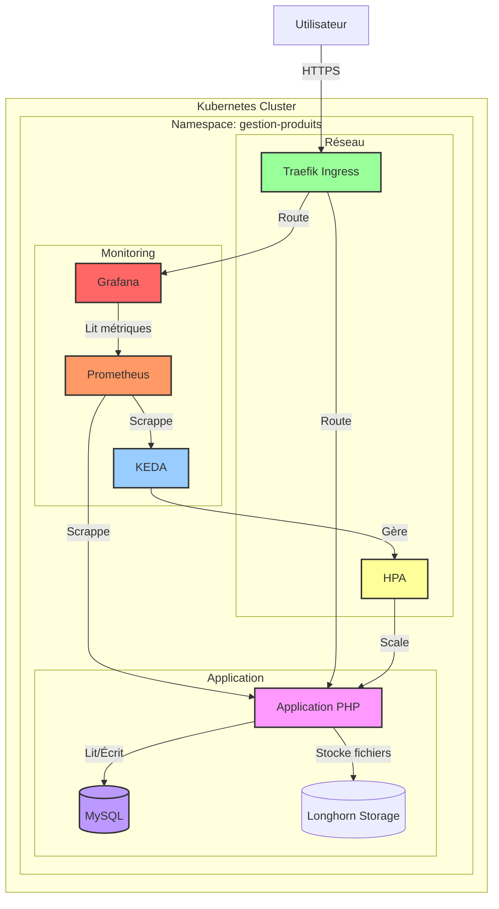
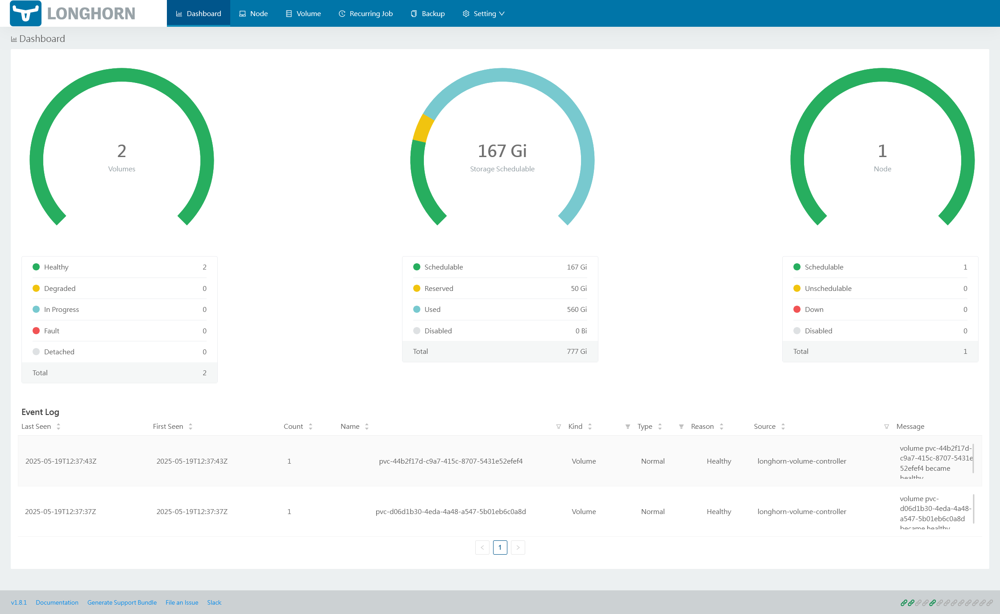

# Gestion Produits Helm Chart

Ce dépôt contient le TP de déploiement Kubernetes et Helm pour l'application **Gestion Produits**

## 1. Description
Chart Helm permettant de déployer :
- Une application PHP (gestion produits)
- Une base de données MySQL
- Un Ingress TLS (Traefik + Cert-Manager)
- Un mécanisme d'autoscaling (KEDA)
- Un dashboard Grafana

## 2. Prérequis
- Kubernetes ≥ 1.21
- Helm ≥ 3.0
- Longhorn (StorageClass)
- Cert-Manager (ClusterIssuer `letsencrypt-prod`)
- Traefik Ingress Controller
- KEDA
- Prometheus & Grafana (pour autoscaling et dashboard)

## 3. Installation de K3s avec plusieurs nœuds et registre privé

### Prérequis
- Au moins 2 machines Linux (1 master, 1+ worker)
- Accès root ou sudo sur toutes les machines
- Accès à internet depuis toutes les machines

### 1. Installation du nœud master

```bash
# Installer K3s sur le nœud master
curl -sfL https://get.k3s.io | sh -

# Récupérer le token pour les workers
sudo cat /var/lib/rancher/k3s/server/node-token
```

### 2. Configuration du registre d'images privé

Créer le fichier de configuration pour le registre privé :

```bash
sudo mkdir -p /etc/rancher/k3s/
sudo nano /etc/rancher/k3s/registries.yaml
```

Ajouter la configuration suivante (remplacer par vos paramètres) :

```yaml
mirrors:
  "votreregistre.com":
    endpoint:
      - "https://votreregistre.com"
configs:
  "votreregistre.com":
    auth:
      username: votrenomutilisateur
      password: votremotdepasse
```

### 3. Redémarrer K3s pour appliquer les changements

```bash
sudo systemctl restart k3s
```

### 4. Joindre des nœuds workers

Sur chaque nœud worker, exécuter (remplacer les valeurs entre <>) :

```bash
curl -sfL https://get.k3s.io | K3S_URL=https://<adresse-ip-du-master>:6443 K3S_TOKEN=<token-du-master> sh -
```

### 5. Vérifier les nœuds

Sur le nœud master :

```bash
kubectl get nodes
```

### 6. Utilisation du registre privé dans les déploiements

Dans vos fichiers de déploiement, spécifiez l'image avec le nom complet du registre :

```yaml
image: votreregistre.com/monnamespace/monimage:tag
```

## 4. Installation de l'application
```bash
# Créer le namespace
kubectl create namespace gestion-produits

# Installer le chart
helm install gestion-produits ./charts \
  --namespace gestion-produits \
  -f values.yaml
```

## 5. Structure du chart
```
charts/
├── Chart.yaml              # métadonnées du chart
├── values.yaml             # valeurs par défaut configurables
└── templates/              # manifests Kubernetes
    ├── app-deployment.yaml
    ├── app-service.yaml
    ├── app-ingress.yaml
    ├── app-scaledobject.yaml
    ├── app-pvc.yaml
    ├── db-deployment.yaml
```

## 6. Démonstration

### Architecture du déploiement



*Figure 1 : Architecture du déploiement Kubernetes*

### Interface utilisateur

*Figure 2 : Capture d'écran de l'interface principale*

### Tableau de bord Grafana

*Figure 3 : Métriques de performance dans Grafana*

### Tableau de bord Longhorn

*Figure 4 : Métriques de performance dans Longhorn*

## 7. Principales configurations (values.yaml)
- **namespace** : namespace Kubernetes
- **app.image** : repository, tag, pullPolicy
- **app.resources** : limite et requête CPU/mémoire
- **app.healthcheck** : liveness, readiness, startup probes
- **db.image** : MySQL image et version
- **db.configuration** : options MySQL (`my.cnf`)
- **persistence** : volumes pour MySQL et uploads
- **ingress** : hôtes, annotations TLS, classe
- **certificate** : issuerRef et secret TLS
- **keda.scaling** : min/max replicas, CPU et Prometheus scaler
- **grafana.dashboard** : ConfigMap du dashboard JSON

## 8. Templates clés
- **app-deployment.yaml** : Deployment PHP + init containers si besoin
- **app-service.yaml** : Service ClusterIP
- **app-ingress.yaml** : Ressource Ingress Traefik avec TLS
- **app-scaledobject.yaml** : ScaledObject KEDA (CPU + custom Prometheus)
- **db-deployment.yaml** : Deployment MySQL
- **db-pvc.yaml** : PersistentVolumeClaim pour MySQL
- **mysql-configmap.yaml** : ConfigMap pour options MySQL
- **grafana-dashboard-configmap.yaml** : ConfigMap contenant le dashboard JSON

## 9. Accès
- Application : https://gestion-produits-masset.germainleignel.com
- Base de données : Credentials dans `values.yaml` (rootPassword)

## 10. Mise à jour et nettoyage
```bash
# Mettre à jour
helm upgrade gestion-produits ./charts -n gestion-produits -f values.yaml

# Supprimer
helm uninstall gestion-produits -n gestion-produits
kubectl delete namespace gestion-produits
```
